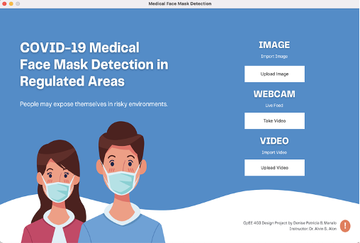

# COVID-19 Detection of Proper and Improper Wearing of Surgical Face Masks in Regulated Areas

Surgical face masks (also known as medical masks) should be worn by the general public to protect against the coronavirus disease caused by the severe acute respiratory syndrome coronavirus 2 (SARSCoV-2) or COVID-19. Numerous studies have demonstrated that face coverings can contain droplets released by the wearer, which account for the majority of virus transmission. Furthermore, the use of face masks appears to be a feasible method of containing COVID-19 spread.

According to the World Health Organization (WHO) people should make wearing a mask a normal part of being around other people. To ensure that masks are as effective as possible, they must be used, stored, and cleaned or disposed of properly. In this context, effective recognition systems are expected to ensure that individuals’ faces are concealed in regulated areas. To accomplish this task, a large dataset of masked faces is required for training deep learning models to distinguish people who are properly wearing masks, not properly wearing masks and those who are not.

